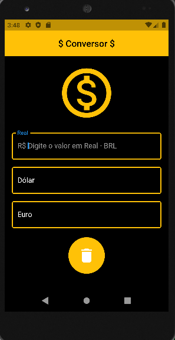
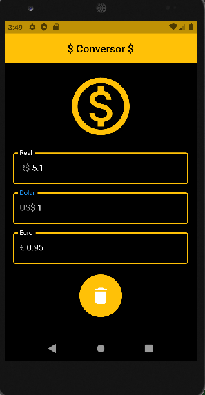

# Conversor de Moedas | Currency Converter

É um projeto criado com o auxílio do Prof. Daniel Ciolfi através do curso: **Criação de Apps Android/iOS/Web com Flutter - 5 cursos em 1** na Udemy. O aplicativo tem como finalidade a conversão automática entre as moedas Real(R$), Dólar(USD) e Euro(€) utilizando a HG Finance API.

It is a project created with the help of Prof. Daniel Ciolfi through the course: **Criação de Apps Android/iOS/Web com Flutter - 5 cursos em 1** on Udemy. The application is intended to automatically convert between Real(R$), Dollar(USD) and Euro(€) using an HG Finance API.

## Tela do Aplicativo | Application Screen

